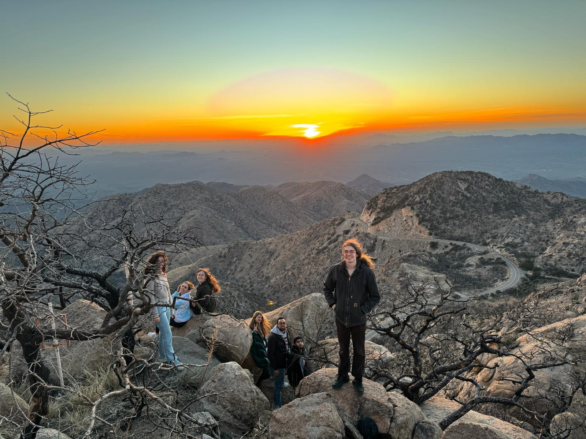

# Welcome to My Website!

Hi everyone! I'm a current master's student at McGill University, studying the nature of Earth-like exoplanets around M-dwarf stars. If you'd like to learn more [about me](./about/index.md), you can find an introduction to [my research](./reasearch/index.md) and some info on some [recent projects](./projects/index.md).

Always looking to connect! Email me at sarah.a.silverman@mail.mcgill.ca

{align="left": style="height:400;width:400px"}
{align="right": style="height:400;width:400px"}
{align="left": style="height:400;width:400px"}
{align='left': style="height:400;width:400px"}
{align="left": style="height:300;width:300px"}
