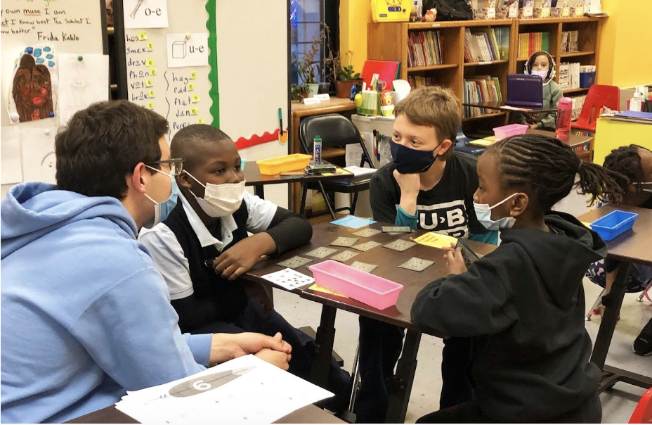

# Scientific Public Outreach and Engagement

I spent two years of my undergrad as the head of public outreach for Columbia's astronomy club Blueshift. I also 

{align="left": style="height:400;width:400px"}
{align="left": style="height:500;width:500px"}
{align="left": style="height:500;width:500px"}

