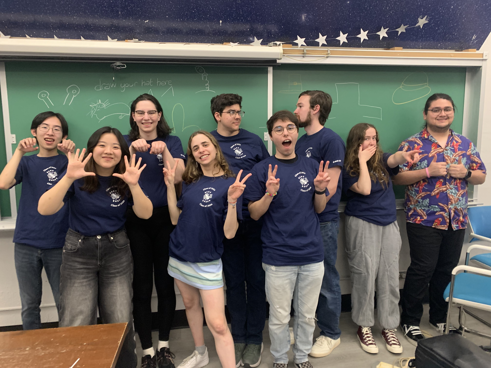
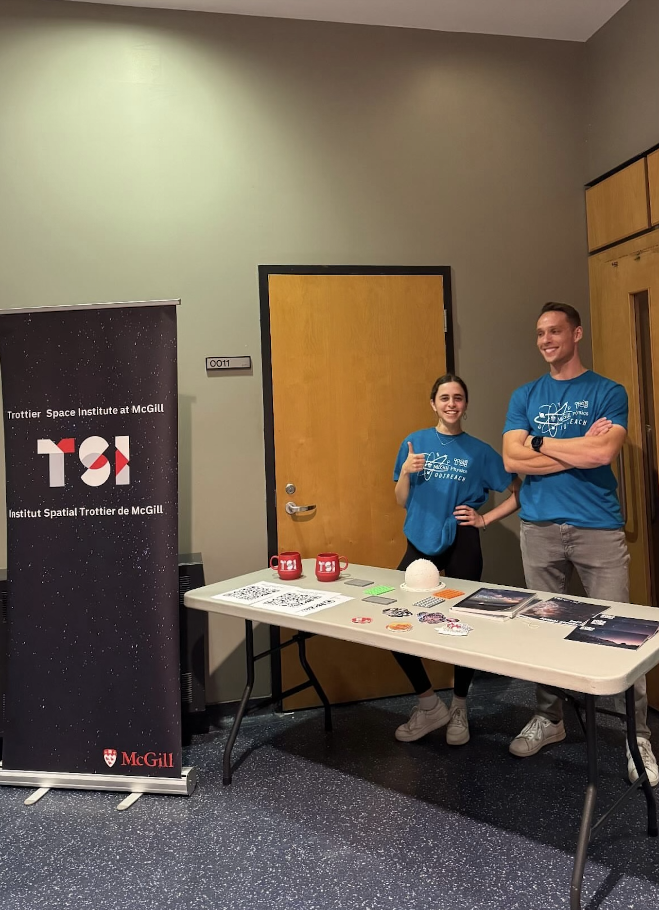
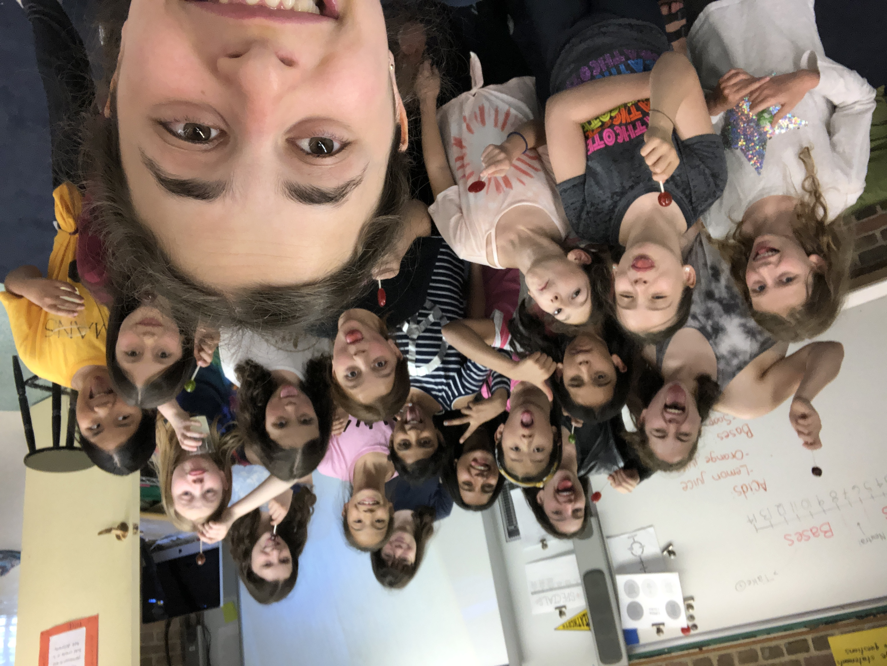

I am drawn to roles that connect with and inspire others, and I have worked with people of all backgrounds and ages, from first graders to adults. I have spent the past four years as an elementary school math tutor in the afterschool program Reading Team Math, and I spent my second and third years of undergrad as the director of public outreach for Columbia's astronomy club Blueshift. Now in Montreal I'm excited to continue to engage the public in the sciences through tutoring and outreach events with the Trottier Space Institute.

{align="left": style="height:500;width:350px"}
{style="height:300;width:300px"}
{style="height:500;width:300px"}
